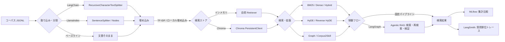
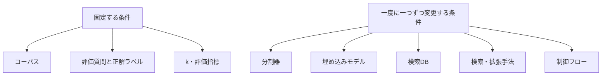

# RAG 手法比較ラボ

同じコーパスと正解付き質問セットに対して複数の RAG 検索戦略を実行し、検索精度を比較するための軽量な実験基盤です。

この`work/`フォルダが実行・持ち運び単位です。ローカルPCでは、このフォルダへ移動してから実行します。

```bash
cd work
uv sync
```

Google Colabでは、`notebooks/rag_lab_colab.ipynb`を開きます。コーパス、評価データ、MLflow結果はGoogle Driveに保存し、GitHubへは追加しません。

## 比較対象の整理

このラボでは、次の層を**別々の実験変数**として扱います。たとえば「ChromaだからHyDE」ではなく、`Chroma × HyDE × LangGraph` のように組み合わせて比較します。

```text
文書取り込み・分割 → 埋め込み → 検索DB → 検索／拡張手法 → 制御フロー → 評価
```

### 1. 文書取り込み・分割

| 実装 | 役割 |
| --- | --- |
| 自前 | 文書をそのまま扱うベースライン |
| LangChain | `RecursiveCharacterTextSplitter` による再帰的分割 |
| LlamaIndex | `SentenceSplitter` によるNode化 |

### 2. 埋め込みモデル

| 実装 | 役割 |
| --- | --- |
| TF-IDF | 依存なしの再現可能なベースライン |
| `multilingual-e5-small` | Colab GPUで動かす本命の多言語埋め込み。クエリ／文書をE5推奨の接頭辞付きでベクトル化 |

### 3. 検索データベース

| 実装 | 役割 |
| --- | --- |
| インメモリ | 自前Retrieverの比較用 |
| Chroma | ローカル永続ベクトルDB。`data/chroma/` に保存しGit除外 |

### 4. 検索・検索拡張手法

| `--method` | 内容 |
| --- | --- |
| `bm25` | キーワード検索 |
| `dense` | TF-IDFコサイン類似度検索 |
| `hybrid` | BM25とDenseのスコア融合 |
| `advanced` | Hybrid後の被覆率ベース再ランキング |
| `hyde` | 検索時に仮想文書を生成してDense検索 |
| `reverse_hyde` | 文書ごとの仮想質問を事前生成して検索 |
| `graph` | エンティティ共有グラフで候補を拡張 |
| `corpus2skill` | 階層スキルツリーを探索 |
| `chroma_e5` | `multilingual-e5-small` で埋め込んだChroma永続Dense検索 |

### 5. 制御フロー

| 実装 | 役割 |
| --- | --- |
| `agentic` | 質問を分解し、複数検索結果を融合 |
| `langgraph_agentic` | LangGraphの`StateGraph`で検索ステップを制御 |

### 6. 観測・評価

| ツール | 役割 |
| --- | --- |
| MLflow | 方式／構成ごとの集計指標、パラメータ、レイテンシ比較 |
| LangSmith | 質問単位の検索トレースと失敗原因分析 |

## フレームワーク構成図



### 比較実験で固定・変更するもの



これは再現可能な比較用実装です。LLM による回答生成や外部 Embedding API を接続する前に、各方式の**検索精度**（Recall@k / MRR / nDCG@k）を公平に測れます。

## 実行

Python 3.11を使います。`chroma_e5`はGoogle Colab GPUで実行します。初回だけE5モデルをダウンロードします。APIキーも料金も不要です。

### Google Colab（推奨）

[`notebooks/rag_lab_colab.ipynb`](notebooks/rag_lab_colab.ipynb) をGoogle Colabで開き、上から順に実行してください。ノートブックはGoogle Driveの`MyDrive/rag-method-lab/`をデータ置き場にします。

- `raw/`: 元文書
- `processed/`: 前処理済みデータ
- `mlruns/`: MLflowの実験結果

ChromaのインデックスはColabの一時ディスク上で毎回再構築します。元文書と設定から再現できるため、DBファイルを同期するより安全です。Google Drive上の実データはGitHubへ追加しないでください。

### 実行環境の切替

検索手法と実行環境は別の変数です。`--profile`で切り替えられます。

| プロファイル | 想定場所 | 埋め込み | 用途 |
| --- | --- | --- | --- |
| `local` | 手元PC | `chroma_hash`（依存なし） | 取り込み・検索手法・評価の学習 |
| `colab` | Google Colab GPU | `multilingual-e5-small` | 実用的な意味検索の検証 |
| `cloud` | VM／コンテナ | `multilingual-e5-small` | 本番に近い継続実行。永続ボリュームを指定 |

```bash
# 手元PC: APIキー・GPUなしで全体を動かす
uv run python -m rag_lab evaluate --profile local --corpus data/example_corpus.jsonl --qa data/example_qa.jsonl

# Colab: E5を使う（Colabノートブックでは --extra colab をインストール済み）
uv run python -m rag_lab evaluate --profile colab --corpus corpus.jsonl --qa qa.jsonl

# クラウド: Chroma永続領域を明示する
uv run python -m rag_lab evaluate --profile cloud --chroma-path /mnt/rag/chroma --corpus corpus.jsonl --qa qa.jsonl
```

```bash
python -m rag_lab evaluate --corpus data/example_corpus.jsonl --qa data/example_qa.jsonl --k 3
```

CSV と JSON の結果を `results/` に保存します。

```bash
python -m rag_lab evaluate --corpus data/example_corpus.jsonl --qa data/example_qa.jsonl \
  --methods bm25,dense,hybrid,advanced,agentic,graph,corpus2skill --k 3 --output results
```

## MLflowによる比較

## フレームワーク実装の利用

- **LangChain**：`RecursiveCharacterTextSplitter` によるチャンク化、Chroma連携
- **LangGraph**：Agentic RAGの検索・再検索・検証フロー
- **LlamaIndex**：文書をNodeへ変換するインジェストパイプライン

`rag_lab.frameworks` に、APIキーなしで実行できる各ライブラリの参照実装を置いています。

同一コーパスで分割方式を比較する例：

```bash
uv run python -m rag_lab evaluate --corpus data/example_corpus.jsonl --qa data/example_qa.jsonl --framework langchain
uv run python -m rag_lab evaluate --corpus data/example_corpus.jsonl --qa data/example_qa.jsonl --framework llamaindex
```

MLflowを有効にすると、手法ごとにRecall@k、MRR、nDCG@k、平均レイテンシを記録します。コーパス本文はMLflowへ送らず、診断用の文書IDだけを保存します。

```bash
uv sync
uv run python -m rag_lab evaluate --corpus data/example_corpus.jsonl --qa data/example_qa.jsonl --mlflow
uv run mlflow ui --backend-store-uri mlruns
```

表示された `http://127.0.0.1:5000` でrunを比較できます。

## LangSmithによるトレース

検索経路を質問単位で追跡する場合は、`.env.example` を `.env` としてコピーし、**Gitに含めず** `LANGSMITH_API_KEY` を設定します。

```bash
uv run python -m rag_lab evaluate --corpus data/example_corpus.jsonl --qa data/example_qa.jsonl --langsmith
```

MLflowは方式別の集計比較、LangSmithは個別質問の検索トレースと失敗分析に使います。

特定の質問について、各方式が何を取得したかを確認できます。

```bash
python -m rag_lab inspect --corpus data/example_corpus.jsonl \
  --query "休暇申請の承認者は誰ですか" --method corpus2skill
```

## 入力形式

コーパスは JSONL で、各行に `id`、`text`、任意の `title` を持たせます。

```json
{"id":"leave-policy","title":"休暇規程","text":"年次有給休暇は直属の上長の承認を得て申請する。"}
```

評価質問は `question` と、正解文書IDの配列 `relevant_ids` を持たせます。

```json
{"id":"q1","question":"休暇申請の承認者は誰ですか","relevant_ids":["leave-policy"]}
```

## Corpus2Skill の解釈

`corpus2skill` は、文書を語彙ベクトルで類似するトピックに再帰的にまとめ、各ノードに `SKILL.md` 相当の要約を作る簡易実装です。問い合わせ時にはツリーの各階層で最も関連する枝だけをたどり、葉の文書を返します。研究版の LLM 要約・クラスタリングへ置換できるよう `Corpus2SkillRetriever` を独立させています。

## 比較時の注意

- 手法間で同じコーパス、同じ質問、同じ `k` を使う。
- 最初は検索指標を改善し、その後に回答の正確性・根拠忠実性を別の評価セットで測る。
- Corpus2Skill / Graph / Agentic は構築・実行コストも計測対象にする。`summary.json` に平均検索時間を出力します。
